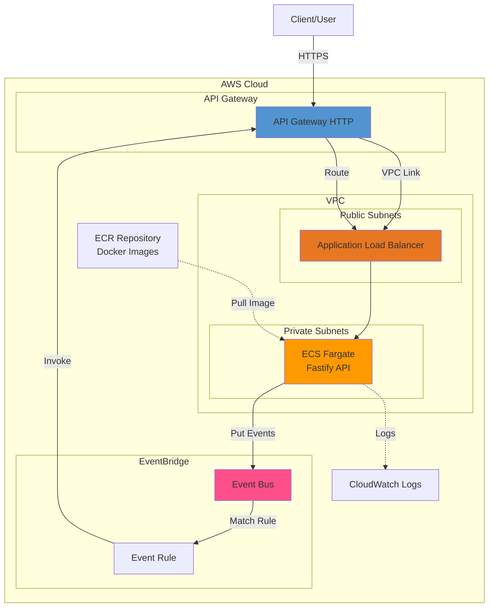

# EventBridge API

API Fastify/TypeScript avec intégration EventBridge, déployable sur AWS Fargate.

## Architecture



## Endpoints

### 1. Recevoir un événement depuis EventBridge

**POST** `/receive-event`

Reçoit un événement depuis EventBridge et le retourne.

**Réponse:** `200 OK`

```json
{
  "detail": {...},
  "source": "custom.app",
  "detail-type": "CustomEvent"
}
```

### 2. Envoyer un événement vers EventBridge

**POST** `/send-event`

Envoie un événement vers EventBridge.

**Body:**
```json
{
  "detail": {
    "key": "value"
  },
  "detailType": "CustomEvent",
  "source": "custom.app"
}
```

**Réponse:** `204 No Content`

## Développement Local

### Prérequis

- Node.js 20+
- Docker & Docker Compose

### Installation

```bash
npm install
```

### Démarrage avec LocalStack

```bash
docker-compose up
```

L'API sera accessible sur `http://localhost:3000`

LocalStack simule EventBridge localement sur le port `4566`.

### Tests des endpoints

**Envoyer un événement:**
```bash
curl -X POST http://localhost:3000/send-event \
  -H "Content-Type: application/json" \
  -d '{
    "detail": {"message": "Hello EventBridge"},
    "detailType": "TestEvent",
    "source": "custom.app"
  }'
```

**Recevoir un événement:**
```bash
curl -X POST http://localhost:3000/receive-event \
  -H "Content-Type: application/json" \
  -d '{
    "detail": {"message": "Test"},
    "source": "custom.app"
  }'
```

## Déploiement AWS

### Prérequis

- Terraform 1.0+
- AWS CLI configuré
- VPC avec subnets publics et privés

### Configuration Terraform

1. Créer un fichier `terraform/terraform.tfvars`:

```hcl
aws_region         = "eu-west-1"
project_name       = "eventbridge-api"
vpc_id             = "vpc-xxxxx"
private_subnet_ids = ["subnet-xxxxx", "subnet-yyyyy"]
public_subnet_ids  = ["subnet-aaaaa", "subnet-bbbbb"]
task_cpu           = "256"
task_memory        = "512"
desired_count      = 1
```

2. Construire et pousser l'image Docker:

```bash
# Build
docker build -t eventbridge-api .

# Tag
aws ecr get-login-password --region eu-west-1 | docker login --username AWS --password-stdin <account-id>.dkr.ecr.eu-west-1.amazonaws.com

docker tag eventbridge-api:latest <account-id>.dkr.ecr.eu-west-1.amazonaws.com/eventbridge-api-repo:latest

# Push
docker push <account-id>.dkr.ecr.eu-west-1.amazonaws.com/eventbridge-api-repo:latest
```

3. Déployer avec Terraform:

```bash
cd terraform
terraform init
terraform plan
terraform apply
```

### Outputs Terraform

Après le déploiement, Terraform affichera:

- `api_endpoint` - URL de l'API Gateway
- `event_bus_name` - Nom du bus EventBridge
- `ecr_repository_url` - URL du repository ECR
- `alb_dns_name` - DNS de l'ALB

## Variables d'environnement

### Développement local

```env
PORT=3000
HOST=0.0.0.0
AWS_REGION=eu-west-1
AWS_ACCESS_KEY_ID=test
AWS_SECRET_ACCESS_KEY=test
EVENTBRIDGE_ENDPOINT=http://localstack:4566
EVENT_BUS_NAME=local-event-bus

# Datadog (optionnel)
DD_API_KEY=your-datadog-api-key
DD_AGENT_HOST=localhost
DD_AGENT_PORT=8125
```

### Production AWS

Les variables sont configurées dans la task definition ECS:

- `PORT` - Port du serveur (3000)
- `HOST` - Host (0.0.0.0)
- `AWS_REGION` - Région AWS
- `EVENT_BUS_NAME` - Nom du bus EventBridge
- `DD_API_KEY` - Clé API Datadog (optionnel)
- `DD_AGENT_HOST` - Host de l'agent Datadog
- `DD_AGENT_PORT` - Port de l'agent Datadog

## Stack Technique

- **Runtime:** Node.js 20
- **Framework:** Fastify 5
- **Language:** TypeScript 5
- **AWS SDK:** EventBridge Client v3
- **Monitoring:** Datadog (hot-shots)
- **Infrastructure:** Terraform
- **Container:** Docker
- **Dev Local:** LocalStack

## Structure du projet

```
.
├── src/
│   ├── index.ts              # API Fastify avec endpoints EventBridge
│   ├── datadog.ts            # Client Datadog pour logs et métriques
│   └── types/
│       └── fastify.d.ts      # Extensions de types Fastify
├── terraform/
│   ├── main.tf               # Infrastructure principale
│   ├── variables.tf          # Variables Terraform
│   └── outputs.tf            # Outputs Terraform
├── localstack-init/
│   └── init.sh               # Script d'initialisation LocalStack
├── Dockerfile                # Image Docker multi-stage
├── docker-compose.yml        # Configuration Docker local
├── tsconfig.json             # Configuration TypeScript
└── package.json              # Dépendances npm
```

## Sécurité

- Les tâches ECS utilisent des rôles IAM avec permissions minimales
- Le service ECS est dans des subnets privés
- L'ALB expose uniquement les endpoints nécessaires
- Les logs sont centralisés dans CloudWatch
- Les images Docker sont scannées dans ECR

## Monitoring avec Datadog

### Configuration

Pour activer Datadog, définissez `DD_API_KEY` dans vos variables d'environnement.

### Métriques envoyées

- `eventbridge.api.request.count` - Nombre de requêtes par méthode, route et status
- `eventbridge.api.request.duration` - Durée des requêtes en ms
- `eventbridge.api.request.size` - Taille des requêtes
- `eventbridge.api.request.success` - Requêtes réussies
- `eventbridge.api.request.error.4xx` - Erreurs client
- `eventbridge.api.request.error.5xx` - Erreurs serveur
- `eventbridge.api.eventbridge.send.count` - Événements envoyés
- `eventbridge.api.eventbridge.receive.count` - Événements reçus
- `eventbridge.api.eventbridge.send.duration` - Temps d'envoi vers EventBridge
- `eventbridge.api.eventbridge.send.error` - Erreurs d'envoi
- `eventbridge.api.server.status` - Status du serveur (1=up, 0=down)

### Logs envoyés

Les logs sont automatiquement envoyés à Datadog avec les niveaux:
- `info` - Informations générales
- `warn` - Avertissements
- `error` - Erreurs

Chaque log inclut le contexte métier et les tags appropriés.

### Agent Datadog

L'application utilise le protocole StatsD pour envoyer les métriques à l'agent Datadog.

En production, assurez-vous que l'agent Datadog est déployé en sidecar dans votre tâche ECS ou en tant que daemon sur vos hôtes.

### Monitoring AWS

- **CloudWatch Logs:** `/ecs/eventbridge-api`
- **Métriques ECS:** CPU, mémoire, nombre de tâches
- **Métriques ALB:** Requêtes, latence, erreurs
- **Métriques EventBridge:** Événements envoyés/reçus

## Licence

MIT
